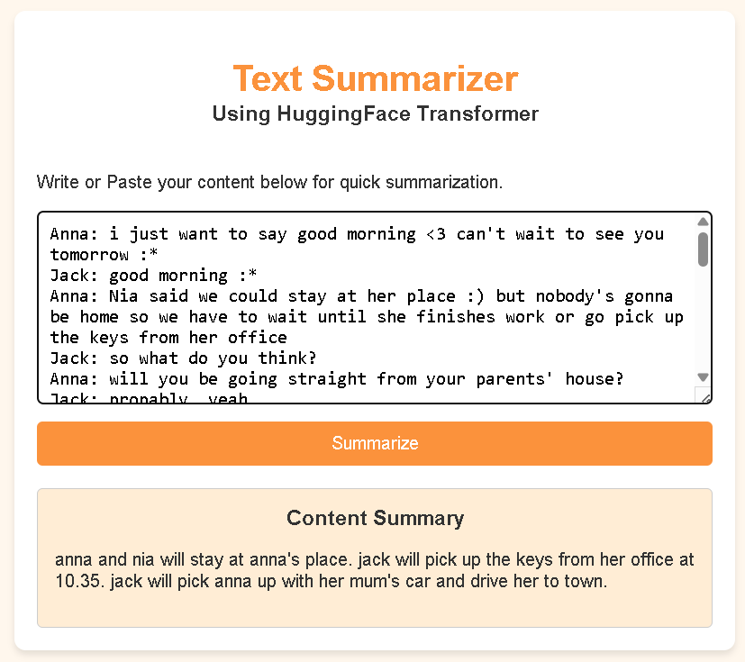

# 📝 Text Summarizer using Fine-Tuned T5 and FastAPI

A web-based **AI-powered Text Summarization** application built using **FastAPI**, **Hugging Face Transformers**, and a **fine-tuned T5 model**. The application generates concise summaries from long text passages through a clean and responsive web interface.

---

## 📌 Project Overview

This project demonstrates the complete lifecycle of an NLP application:

* Data preprocessing
* Fine-tuning a Transformer model
* Model inference
* Backend API development with FastAPI
* Frontend integration using HTML, CSS, and JavaScript
* Deployment for public access

The model has been fine-tuned on the **SAMSum dialogue summarization dataset** to generate meaningful summaries from conversational or textual input.

---

## 📷 Application Preview

<h2 align="center">Home Page</h2>
<p align="center">
    
</p>

<h2 align="center">Summary Result</h2>
<p align="center">
    
</p>


## ✨ Features

* 🔹 AI-powered text summarization
* 🔹 Fine-tuned T5 Transformer model
* 🔹 FastAPI REST API backend
* 🔹 Clean and responsive user interface
* 🔹 Real-time summary generation
* 🔹 Easy deployment on cloud platforms (Render, Railway, etc.)

---

## 🛠️ Tech Stack

### Backend

* Python
* FastAPI
* Pydantic

### Deep Learning

* PyTorch
* Hugging Face Transformers
* T5 (Fine-Tuned)

### Frontend

* HTML5
* CSS3
* JavaScript (Fetch API)

### Deployment

* GitHub
* Render

---

## 📂 Project Structure

```text
Text_Summarizer_App/
│
├── app.py
├── requirements.txt
├── runtime.txt
├── templates/
│   └── index.html
│
├── saved_summary_model/
│   ├── config.json
│   ├── generation_config.json
│   ├── model.safetensors
│   ├── tokenizer.json
│   └── tokenizer_config.json
│
└── README.md
```

---

## ⚙️ Installation

### 1. Clone the repository

```bash
git clone https://github.com/mahboob-alam2027/Text_Summarizer_App.git
```

```bash
cd Text_Summarizer_App
```

---

### 2. Create a virtual environment

Windows

```bash
python -m venv venv
venv\Scripts\activate
```

Linux / macOS

```bash
python3 -m venv venv
source venv/bin/activate
```

---

### 3. Install dependencies

```bash
pip install -r requirements.txt
```

---

### 4. Run the application

```bash
uvicorn app:app --reload
```

Open your browser:

```
http://127.0.0.1:8000
```

---

## 🚀 How It Works

1. User enters a paragraph or dialogue.
2. The input is cleaned and preprocessed.
3. The tokenizer converts text into input tokens.
4. The fine-tuned T5 model generates a summary.
5. The generated summary is returned through the FastAPI backend.
6. The summary is displayed instantly on the webpage.

---

## 🧠 Model Information

**Base Model**

* T5-Small

**Framework**

* Hugging Face Transformers

**Training Dataset**

* SAMSum Dialogue Summarization Dataset

**Task**

* Abstractive Text Summarization

---

## 📷 Application Preview

> Add screenshots or a GIF of the application here.

Example:

```
assets/
├── home.png
├── summary.png
└── demo.gif
```

---

## 📈 Future Improvements

* Support PDF document summarization
* URL summarization
* Upload DOCX/TXT files
* Adjustable summary length
* Multi-language summarization
* Authentication and user history
* Docker support
* GPU inference optimization

---

## 🤝 Contributing

Contributions are welcome.

1. Fork the repository.
2. Create a new feature branch.
3. Commit your changes.
4. Push to your branch.
5. Open a Pull Request.

---

## 👨‍💻 Author

**Mahboob Alam**

Electrical and Electronics Engineering Student

Aspiring AI/ML & Data Science Engineer

* GitHub: https://github.com/mahboob-alam2027
* LinkedIn: https://linkedin.com/in/mahboob-alam01
---

## ⭐ Support

If you found this project helpful:

* ⭐ Star the repository
* 🍴 Fork the project
* 📝 Share your feedback

Your support motivates further development and improvements.

---

## 📄 License

This project is intended for educational and research purposes.

Feel free to use and modify it with proper attribution.
